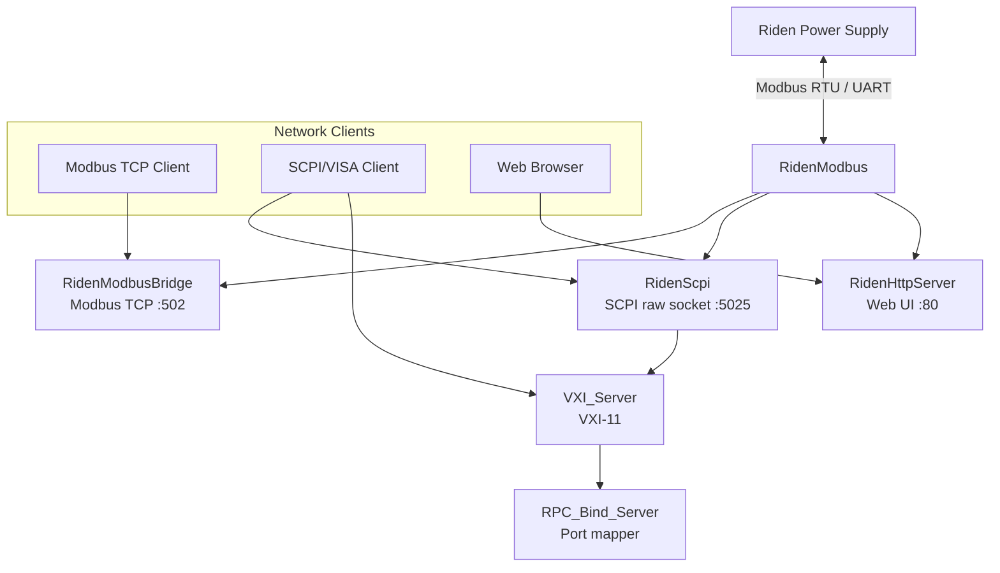
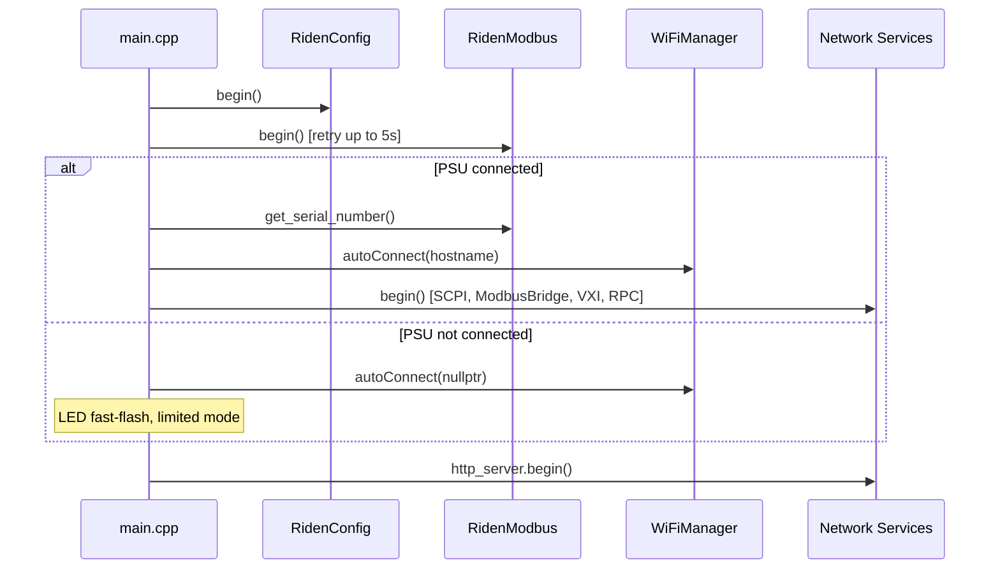

# Architecture

## Overview

The firmware acts as a protocol bridge between a Riden power supply (connected via UART/Modbus RTU) and multiple network protocols (Modbus TCP, SCPI raw socket, VXI-11, HTTP).

## Initialization Flow

## Main Loop

All services use cooperative multitasking via `loop()` calls in `main.cpp::loop()`:
- `riden_modbus.loop()` — process pending RTU transactions
- `riden_scpi.loop()` — accept/handle SCPI socket clients
- `modbus_bridge.loop()` — handle Modbus TCP requests
- `rpc_bind_server.loop()` / `vxi_server.loop()` — VXI-11 protocol
- `http_server.loop()` — web interface requests
- `ArduinoOTA.handle()` — OTA firmware updates
- `MDNS.update()` — mDNS responder

## Design Patterns

- **Namespace:** All project code lives in `RidenDongle` namespace
- **Composition:** Services receive `RidenModbus&` reference for PSU access
- **Static instances:** All service objects are static globals in `main.cpp`
- **Conditional logging:** Logging macros compile to no-ops unless `MODBUS_USE_SOFWARE_SERIAL` is defined (development board only)
- **SCPI bridge pattern:** `SCPI_handler_interface` abstracts SCPI parser access so VXI-11 and raw socket share the same parser
