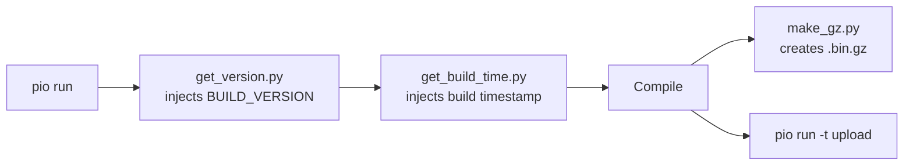
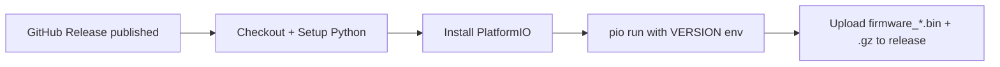
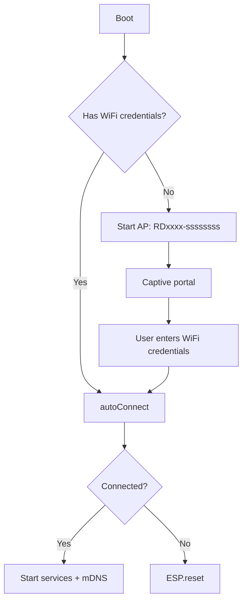
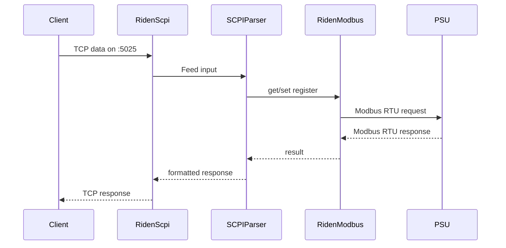
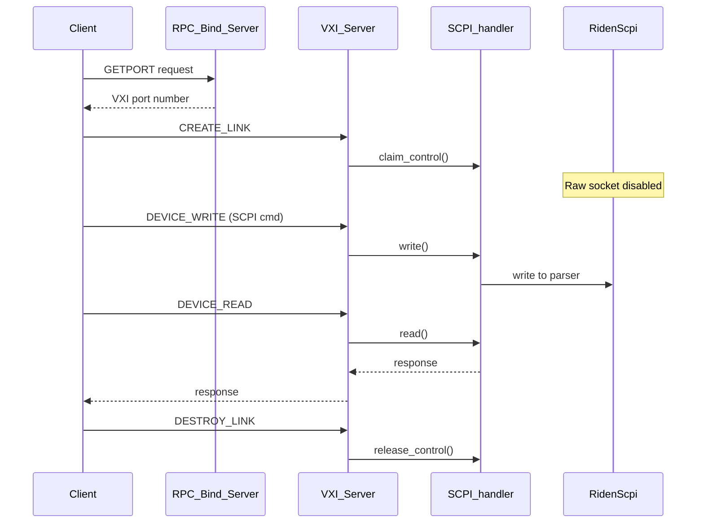

# Workflows

## Build and Flash

## Release Workflow (CI)

## WiFi Connection Flow

## SCPI Request Flow (Raw Socket)

## VXI-11 Request Flow

## Web UI Control Flow

The control page uses AJAX polling (`/status` endpoint) to update readings every ~1 second, and POSTs to `/set_v`, `/set_i`, `/toggle_out` for control actions.

## OTA Update

Available via:
1. ArduinoOTA (mDNS-discoverable, PlatformIO compatible)
2. HTTP POST to `/firmware` (web interface upload)
